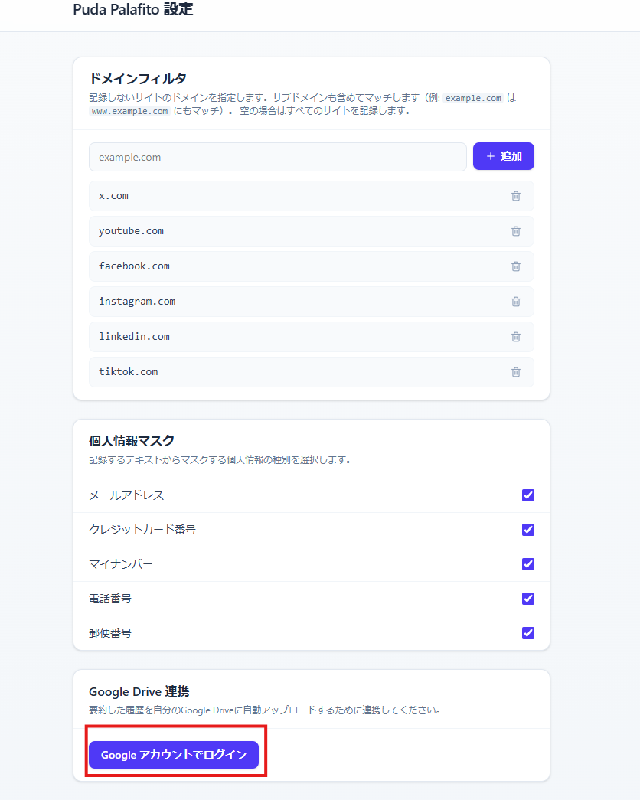
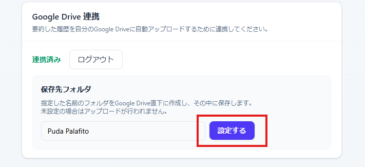

# ユーザーガイド (User Guide)

このドキュメントでは、**puda-palafito** のインストールから Google Drive 連携、実際の使用方法までを解説します。

## 1. 拡張機能のインストール

開発版の拡張機能をブラウザに読み込みます。

1. プロジェクトのビルドが完了していることを確認します（`.output/chrome-mv3-dev` フォルダが存在すること）。
2. Chrome ブラウザで `chrome://extensions` を開きます。
3. 右上の **「デベロッパー モード」** をオンにします。
4. **「パッケージ化されていない拡張機能を読み込む」** をクリックします。
5. プロジェクト内の `.output/chrome-mv3-dev` フォルダを選択して読み込みます。

## 2. Google Drive API の準備

データの保存には Google Drive を使用するため、事前に Google Cloud でのプロジェクト作成が必要です。

* [Google Drive API の設定手順](./google-drive-api-setup.md) を参照し、**クライアント ID** を取得して `.env` に設定してください。
* 設定が完了したら、拡張機能を再ビルドし、ブラウザに再インストールしてください。

## 3. Google Drive 連携・初期設定

拡張機能から Google Drive へアクセスするための認可設定を行います。

### 3-1. 設定画面を開く

1. Chrome ブラウザの右上にある拡張機能アイコンをクリックし、**puda-palafito** を選択してサイドパネルを開きます。
2. サイドパネル下部にある **「設定（ギアアイコン）」** をクリックします。
3. 新しいタブで「Puda Palafito 設定」画面が開きます。

### 3-2. Google アカウントでのログイン

1. 設定画面の「Google Drive 連携」セクションにある **「Google アカウントでログイン」** をクリックします。  
  
2. 使用する Google アカウントを選択します。
3. 「Google hasn't verified this app（このアプリは確認されていません）」という警告が表示された場合は、**「Continue（続行）」** をクリックして進めてください。
4. アプリが求める権限（Google ドライブへのアクセスなど）を確認し、**「Continue（続行）」** をクリックして承認します。

### 3-3. 保存先フォルダの設定

1. ログイン完了後、画面に「連携済み」と表示されたら、保存先フォルダの **「選択する」** をクリックします。
2. フォルダ選択ダイアログが表示されるので、抽出データを保存したい Google Drive 上のフォルダを指定します。
3. 最後に画面下部の **「保存する」** をクリックして設定を確定させます。  
  

## 4. 基本的な使い方

設定が完了したら、実際にウェブページを保存してみましょう。

1. 保存したい任意のウェブページを閲覧します。
2. そのまま一定時間（解析が完了するまで）待機します。
3. サイドパネルを開くと、新しいカード（抽出された本文の要約など）が追加されます。
4. Google Drive 上の指定したフォルダに、該当のデータファイルが自動で作成されていることを確認してください。

## 5. Gems と連携する

保存したデータを Gemini の Gems に読み込ませたい場合は、続けて [Gems セットアップガイド](./gems-guide.md) を参照してください。
